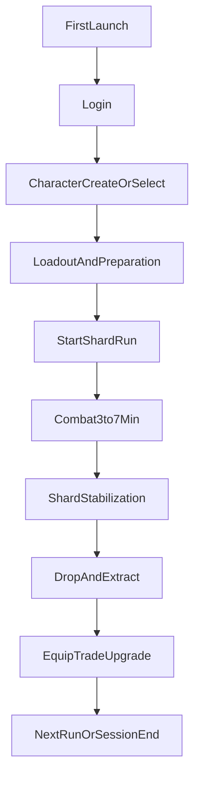
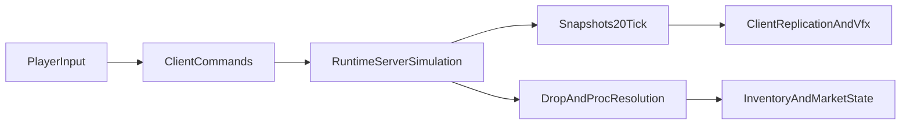

# Полный диздок MVP: Осколки Пустоты

## 0) Паспорт документа

- Версия: `0.1-mvp-master`
- Статус: рабочая спецификация MVP/Early Access
- Формат: master-документ для разбиения на страницы Google Docs
- Жанр: вертикальная онлайн ARPG с короткими сессиями
- Платформы MVP: Android, iOS, PC (единый аккаунт и единая экономика)
- Сезонный цикл MVP: 14 дней

## 1) Продуктовое видение

### 1.1 Фантазия игрока

Игрок является Проводником Осколков: входит в нестабильные разломы, очищает и стабилизирует искаженные фрагменты мира, усиливает билд через добычу и торговлю.

### 1.2 Уникальность проекта

- Вертикальная ARPG (свободная ниша на mobile).
- Короткий сезонный цикл (14 дней) с частой сменой меты.
- Билдостроение через уникальные предметы, а не через громоздкое древо.
- Сервер-авторитетный бой и экономика.
- Асинхронный рынок как системный мотиватор возврата.

### 1.3 Дизайн-принципы

- Билд рождается уником, редкие предметы масштабируют математику.
- Управление простое, синергии глубокие.
- Клиент визуализирует, сервер рассчитывает.
- Контент проектируется под команду из 2 человек (максимум value на минимальном production cost).

## 2) Рамки MVP/Early Access

### 2.1 Что обязательно в MVP

- Логин, выбор/создание персонажа, вход в забег.
- Бой в сессиях 3-7 минут.
- Репликация игрока, врагов, снарядов, дропа.
- Инвентарь и экипировка с влиянием на статы.
- Асинхронный рынок без direct trade.
- 14-дневная лига с вайпом экономики и лидербордом.
- Минимум 3 класса, 1-2 базовых осколка сложности, стартовый пул уникальных предметов.

### 2.2 Что вне MVP (post-MVP)

- Кооператив.
- Кланы и клановые лиги.
- PvP-режимы.
- Сложные эндгейм-системы (коррупция, синтез уников, сезонные мутации навыков как отдельная глубина).

## 3) Целевая аудитория и продуктовые цели

### 3.1 Аудитория

- Ядро: игроки ARPG/loot-игр, ценящие сбор билдов и рыночную экономику.
- Secondary: mobile-игроки, которым нужен короткий session loop с ощутимым прогрессом.

### 3.2 Цели релиза MVP

- Доказать удержание через цикл "забег -> дроп -> усиление -> следующий забег".
- Доказать работоспособность сезонной экономики (14 дней).
- Доказать читаемость и удовольствие от боя в вертикальном формате.

## 4) Полный пользовательский путь (E2E)

### 4.1 Первый вход (FTUE-lite)

1. Логин.
2. Выбор/создание персонажа (класс, имя, внешний вид).
3. Краткая подсказка по трем слотам умений и авто-переключателям.
4. Первый забег в базовый осколок.
5. Первичный дроп, экипировка, возврат в меню.
6. Подсказка о рынке и сезонном прогрессе.

### 4.2 Повторяющийся игровой цикл

1. Подготовка: проверка лоадаута, экипировки, рынка.
2. Вход в осколок.
3. Бой и стабилизация.
4. Лут/выход.
5. Улучшение билда.
6. Повышение сложности осколка/нестабильности.

### 4.3 Возвратный цикл

- День 1: освоение и первые синергии.
- День 3: рыночные решения, точечная охота за модами/униками.
- День 7+: участие в рейтинге лиги, дооптимизация билда.
- День 14: сезонный финиш, вайп экономики, вход в новую лигу.

### 4.4 UX-развилки по платформам

- Mobile: три кнопки скиллов под джойстиком, акцент на управление одной рукой.
- PC: `QWE` для тех же слотов, управление движением/таргетингом через существующую схему клиента.
- Поведение слотов одинаково между платформами (единая боевая логика, разные способы ввода).

## 5) Core Gameplay Loop

### 5.1 Сессионный loop

- Длительность: 3-7 минут.
- Цель сессии: очистка арены-острова, стабилизация разлома, извлечение ценности.
- Темп: высокая плотность боевых решений, минимум downtime.

### 5.2 Мета-loop

- Усиление через предметы и теги.
- Рынок для обмена избыточной добычи на нужные компоненты билда.
- Переход к более нестабильным осколкам за больший риск и награду.

### 5.3 Цикл риска/награды

- Больше нестабильности = больше искажений, опасности и наград.
- Игрок сам выбирает глубину риска.
- Смерть в забеге должна быть понятной и честной (телеграфы, читаемые угрозы, ясная обратная связь).

## 6) Боевая система (спецификация)

### 6.1 Слоты способностей

- `Attack` (без классического кд; серверный "кд" используется как темп атаки/каста и синхронизация анимации).
- `SupportA` (обычно 3-15 сек кд, либо аура/саммон без кд).
- `SupportB` (обычно 3-15 сек кд, либо аура/саммон без кд).

### 6.2 Attack-slot режимы (cast mode)

- `stand_only`: активируется только в стоячем положении.
- `move_only`: активируется только в движении.
- `any`: активируется и в движении, и стоя.

### 6.3 Movement skill модель

Правила:

- При старте движения movement-скилл активируется сразу.
- Пока активен, работает в течение своего active window.
- Кулдаун начинает тикать только после деактивации.
- При остановке персонажа скилл прерывается и сразу уходит в кд.

MVP-набор вариантов:

- Разлом-форма (ускорение + сниженный входящий урон).
- Кувырок (быстрый рывок + шанс избегания, без атаки во время действия).
- Ускорение (короткий кд, без доп-эффектов).
- Щитовой разбег (только при экипированном щите; фронтальный блок, контроль ближней зоны, ограничения по атаке).

### 6.4 Управление автокастом

- Каждый из трех слотов можно включать/выключать отдельно.
- Выключенный слот не исполняется серверной логикой автокаста.
- Интерфейс обязан явно показывать состояние слота (ON/OFF + визуальный индикатор).

### 6.5 Принципы боевого UX

- Четкий контраст опасных зон и полезных эффектов.
- Минимум "грязи" на экране.
- Любое ограничение (нельзя атаковать в кувырке, нужен щит и т.п.) отображается в UI явно.

## 7) Предметы, теги, билды

### 7.1 Редкости и роли

- Обычные: базовые статы/затычки.
- Магические: ранняя прогрессия.
- Редкие: основная статовая математика.
- Уникальные: изменение механики билда.

### 7.2 Философия уникальных

- Уникальный предмет не обязан иметь лучший DPS.
- Он должен открывать новый способ игры.
- Оценка "сильный уник" = степень изменения паттерна боя + синергия с тегами.

### 7.3 Система тегов

- Каждый скилл имеет набор тегов (например `Spell`, `Projectile`, `Fire`, `AoE`).
- Моды предметов усиливают теги, а не только "класс оружия".
- Теги являются основным языком билдостроения в MVP.

### 7.4 Правила itemization для MVP

- Игрок должен понимать ценность дропа по 1-2 секундам просмотра.
- У редких предметов фокус на скейлящие боевые статы.
- У уникальных фокус на изменении поведения навыков/пространства боя.

## 8) Экономика и рынок

### 8.1 Модель рынка

- Асинхронная торговля через листинг/покупку.
- Прямой трейд игрок-игрок отсутствует в MVP.
- Сервер является единственным источником истины по владению предметом.

### 8.2 Потоки ценности

- Вход: дропы из забегов, сезонные награды.
- Выход: покупки на рынке, оптимизация билда, подготовка к более сложным осколкам.
- Критический драйвер спроса: редкие и уникальные предметы для мета-билдов.

### 8.3 Анти-абуз рамки MVP

- Ограничения на подозрительные транзакции (частота, паттерны, ценовые выбросы).
- Серверная валидация всех торговых операций.
- Логирование ключевых действий экономики для пост-анализов.

## 9) Лиги (14 дней)

### 9.1 Цикл лиги

- Старт лиги: новая сезонная механика + новый лидерборд + экономический reset.
- Середина лиги: стабилизация меты и рост рыночной активности.
- Конец лиги: конкурентная гонка и подготовка к следующему reset.

### 9.2 Сезонная механика (шаблон MVP)

Шаблон "дешево в продакшне, высоко в ощущении":

- 1 главный системный модификатор боя/карты.
- 1-2 визуальных маркера лиги (свет, фильтр, VFX).
- Переиспользование базовых ассетов.

### 9.3 Примеры механик

- Зеркала: копии врагов.
- Гравитация: притяжение к центру арены.
- Разрыв: постепенный распад безопасного пространства острова.

## 10) Прогрессия и контентная глубина MVP

### 10.1 Линия сложности

- Базовые осколки.
- Усиленные осколки.
- Модифицированные осколки (с набором аффиксов/условий).

### 10.2 Стабильность разлома

- Игрок поднимает нестабильность для увеличения наград.
- Высокая нестабильность добавляет системные и визуальные искажения.
- Искажения служат и механикой сложности, и частью атмосферы.

### 10.3 Контентный минимум для релизной полноты

- 3 класса.
- 8-12 атакующих скиллов (распределение по классам и архетипам).
- 10-15 модульных островов/арен.
- 8-12 типов мобов + 2-3 боссовых encounter-архетипа.
- 20+ уникальных предметов (минимум 6 мета-образующих).

## 11) Сеттинг и визуальный production guide

### 11.1 Философия мира

Мир погиб и раскололся; каждый осколок является фрагментом реальности с локальными нарушениями логики.

### 11.2 Визуальный язык

- Темный фон (черный/глубокий фиолетовый), яркие боевые эффекты.
- Четкие силуэты важнее детализации.
- Трещины реальности через emissive + пульсация.

### 11.3 Production-гайд для команды 2 человека

- Делать модульные арены-острова вместо больших локаций.
- Вариативность создавать светом, фильтрами, VFX и сезонными модификаторами.
- Низкая геометрическая сложность окружения, фокус ресурсов на боевой читаемости.

### 11.4 Механика "Искажение" (включить в MVP roadmap)

- На карте спавнится слой искаженных объектов/артефактов.
- С убийством врагов процент искажения падает, слой постепенно очищается.
- UI и цветокор могут частично искажаться при высокой нестабильности.
- Искажение интегрируется в цели квестов/задач сессии.

## 12) UI/UX спецификация MVP

### 12.1 HUD

- Джойстик движения (mobile) / эквивалент ввода (PC).
- Три кнопки слотов с индикацией кд и ON/OFF.
- HP/статус-бар игрока.
- Индикатор прогресса стабилизации осколка.
- Минимальный блок уведомлений о дропе/статусах.

### 12.2 Экраны

- Login.
- Character Select/Create.
- Run HUD.
- Inventory (additive в Run).
- Market.
- Talents/Build management (минимальный MVP).
- Run Result.

### 12.3 UX-принципы

- Одна операция = одно очевидное действие.
- Важные изменения состояния имеют мгновенный визуальный ответ.
- Нет скрытых правил боя/кулдауна: все объясняется через явные индикаторы.

## 13) Монетизация MVP

- Только косметика (без pay-to-win).
- Категории: скины, следы, ауры, анимации, сезонный пропуск (cosmetic track).
- Опционально: дополнительные вкладки склада как quality-of-life.

## 14) Техническое приложение

### 14.1 Сетевая модель (высокий уровень)

- Бой и экономика сервер-авторитетны.
- Игрок: client-side prediction + server reconciliation.
- Враги/снаряды: snapshot interpolation.

### 14.2 Контуры клиентских подсистем (по текущему проекту)

- Транспорт/сессия: `Assets/Net/Network/NetworkSessionRunner.cs`.
- Протокол: `Assets/Net/Network/NetworkProtocol.cs`.
- Репликация: `Assets/Game/Network/*Replicator.cs`.
- Ввод и toggles: `Assets/Game/Player/PlayerInputController.cs`, `Assets/Game/Player/AutoSkillToggleController.cs`.
- Презентация скиллов/анимаций: `Assets/Game/Skills/SkillPresentationDriver.cs`, `Assets/Game/Animation/PlayerAbilityAnimationDriver.cs`.

### 14.3 Правила синхронизации анимаций

- Attack анимация триггерится только через серверный факт атаки.
- Скорость анимации может нормализоваться под серверный cooldown окна атаки.
- Movement анимации/состояния привязаны к серверным флагам активности movement-скилла.

### 14.4 Состояния забега (state model)

`Idle -> Connect -> InRun -> ResolveEnd -> Results -> Exit`.

Ключевые события:

- Connect accepted/rejected.
- Snapshot tick.
- Player dead/finish requested.
- Run ended confirmed.

## 15) Баланс, аналитика, QA, readiness

### 15.1 KPI MVP

- Session length median: 3-7 минут.
- FTUE completion: доля игроков, завершивших первый забег.
- D1 proxy: возвращение в игру в течение 24 часов.
- Economy health proxy: доля активных листингов/покупок на игрока.

### 15.2 События аналитики (минимум)

- `login_success`, `character_created`, `run_start`, `run_end`, `player_death`.
- `slot_toggled`, `skill_used`, `movement_skill_active_time`.
- `loot_drop`, `loot_pickup`, `item_equipped`.
- `market_listed`, `market_bought`, `market_cancelled`.
- `league_rank_changed`.

### 15.3 QA-чеклисты

Флоу:

- Создание персонажа -> вход в забег -> завершение -> возврат.
- Повторный вход после relog без потери состояния.

Бой:

- Корректная работа трех слотов и их ON/OFF.
- Валидная работа movement-скиллов (start/interrupt/cooldown).
- Визуальная синхронность атаки и фактического урона.

Экономика:

- Полный цикл листинга и покупки.
- Отсутствие дюпов и рассинхрона владения.

Сеть:

- Корректность поведения при лаге/потере пакетов.
- Устойчивость репликации при пиковых событиях (много дропа/мобов).

### 15.4 Definition of Done (MVP Release Gate)

- Все обязательные фичи из раздела 2.1 завершены и протестированы.
- 1 полный 14-дневный цикл лиги отработан без критических проблем экономики.
- Нет блокирующих багов в core loop и прогрессии.
- Метрики показывают жизнеспособность цикла "забег -> усиление -> возврат".

## 16) Риски и план смягчения

- Риск: перегрузка UI в вертикали. Митигировать через жесткую иерархию важности и чистый HUD.
- Риск: инфляция экономики. Митигировать дефицитом драйвер-уников и контролем источников валюты.
- Риск: расползание scope. Митигировать lock MVP-границ и отдельным backlog post-MVP.
- Риск: нечитаемый бой при обилии VFX. Митигировать лимитами частиц и контрастными телеграфами.

## 17) Дорожная карта до релиза (этапы)

### Этап A: Core Foundation

- Стабильный run flow.
- Серверная валидация боя/дропа.
- Минимальный контент классов и врагов.

### Этап B: Economy and League

- Рынок, лидерборд, сезонный reset.
- Базовый live-ops ритм 14 дней.

### Этап C: Polish and Release

- UX-полировка, телеметрия, баланс-пассы.
- Предрелизный QA и soft launch-проверки.
- MVP/Early Access релиз.

## 18) Формат разбиения по страницам Google Docs

Рекомендуемая структура страниц:

1. Product Vision & MVP Scope
2. User Journey & UX Flows
3. Combat Systems Spec
4. Itemization & Buildcraft
5. Economy & Market
6. League Design (14-day cycle)
7. Progression & Content Plan
8. World, Art, VFX Guidelines
9. Technical Appendix
10. KPI, Analytics, QA, Release Checklist

Этот файл является master-источником и обновляется при каждом крупном решении по дизайну/релизу.