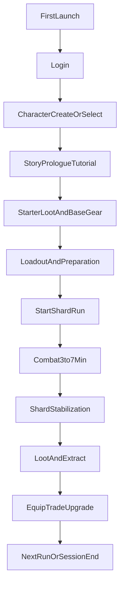
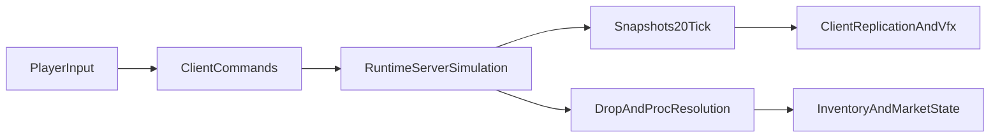

# Осколки Пустоты — Master-диздок MVP

## Статус и назначение
- Версия: `0.2-mvp-master`
- Статус: рабочая спецификация для разработки и релиз-решений
- Назначение: единый источник истины по продукту, системам и релизной готовности
- Платформы: Android, iOS, PC (единый аккаунт и экономика)
- Сезон: 14 дней

## Как читать этот документ
- **Часть A**: что за игра и где границы MVP.
- **Часть B**: как игрок проходит путь и что происходит в бою/прогрессии.
- **Часть C**: как это реализуется технически.
- **Часть D**: как принимаем решение о релизе.

---

## Оглавление
1. North Star и MVP-рамки
2. Пользовательский путь (E2E)
3. Core Loop и прогрессия
4. Боевая система
5. Предметы и билдостроение
6. Экономика и рынок
7. Лиги и LiveOps
8. Сеттинг и визуальный продакшн
9. UI/UX спецификация
10. Техприложение
11. Контент-план MVP
12. KPI, QA, Release Gate
13. Риски и roadmap

---

## 1) North Star и MVP-рамки

### 1.1 Фантазия и ценность
Игрок — Проводник Осколков. Он заходит в нестабильные разломы, зачищает их, стабилизирует пространство и собирает билд через лут и экономику.

### 1.2 Уникальность проекта
- Вертикальная ARPG с короткими сессиями.
- Лиги по 14 дней с регулярным reset экономики.
- Билд через уникальные предметы и теги, без тяжелого древа.
- Сервер-авторитетная боевая симуляция и рынок.

### 1.3 Границы MVP
**В MVP:**
- Login -> Character Create/Select -> Run -> Results.
- Бой 3-7 минут, дроп, инвентарь, экипировка.
- Асинхронный рынок без прямого трейда.
- 3 класса, стартовый набор осколков, лидерборд лиги.

**После MVP:**
- Кооп, кланы, PvP.
- Сложные эндгейм-системы (коррупция/синтез уников).

### 1.4 Продуктовые цели MVP
- Доказать рабочий цикл: `забег -> дроп -> усиление -> следующий забег`.
- Доказать, что 14-дневная лига держит активность.
- Доказать читаемость боя в вертикальном формате.

---

## 2) Пользовательский путь (E2E)

### 2.1 Первый запуск (FTUE-lite)
1. Логин.
2. Создание/выбор персонажа.
3. Переход в короткую сюжетную обучающую кампанию (обязательный пролог).
4. Обучение базовым действиям: движение, 3 слота, toggle `ON/OFF`, лут, экипировка.
5. Завершение пролога и получение стартового набора экипировки.
6. Выход в основной цикл осколков (сезонный контент, рынок, прогрессия).

### 2.2 Регулярный цикл
1. Проверка билда и экипировки.
2. Запуск осколка.
3. Зачистка и стабилизация.
4. Лут и выход.
5. Усиление персонажа/торговля.
6. Переход в более сложный осколок.

### 2.3 Возвратный цикл
- День 1: освоение и первые связки.
- День 3: активная торговля и оптимизация билда.
- День 7+: гонка в таблице сезона.
- День 14: завершение лиги и reset.

### 2.4 Платформенный UX
- Mobile: 3 кнопки навыков под джойстиком.
- PC: те же слоты на `QWE`.
- Боевая логика едина; отличается только способ ввода.

### 2.5 Обязательный пролог перед первым сезоном
- Пролог проходится один раз на аккаунт (или до явного пропуска для твинков в будущем).
- Цель пролога: научить core-loop без перегруза и дать контекст мира.
- После завершения пролога игрок получает стартовый билд-пак и открывает обычные забеги.

---

## 3) Core Loop и прогрессия

### 3.1 Session Loop (3-7 минут)
- Игрок входит в остров-осколок.
- Убивает волны и стабилизирует разлом.
- Получает награду и выходит.

### 3.2 Meta Loop
- Добыча -> экипировка -> торговля -> усиление.
- Рост сложности через нестабильность осколка.

### 3.3 Risk/Reward
- Больше нестабильности = больше дропа и опасности.
- Игрок сам выбирает глубину риска.

### 3.4 Линия сложности
- Базовые осколки.
- Усиленные осколки.
- Модифицированные осколки.

---

## 4) Боевая система

### 4.1 Слоты умений
- `Attack`: без обычного кд, серверный темп задает ритм ударов/каста.
- `SupportA`: обычно кд 3-15 сек.
- `SupportB`: обычно кд 3-15 сек.

### 4.2 Режимы атаки (`CastMode`)
- `stand_only`
- `move_only`
- `any`

### 4.3 Movement skills — единые правила
- Активируются на старте движения.
- Во время активности кулдаун не тикает.
- Кулдаун начинается после деактивации.
- Остановка игрока прерывает скилл и запускает кулдаун.

### 4.4 Варианты movement (MVP)
- Разлом-форма.
- Кувырок.
- Ускорение.
- Щитовой разбег (требуется щит).

### 4.5 Toggle-логика
- Каждый слот можно включать/выключать вручную.
- Отключенный слот не кастуется.
- UI всегда показывает статус `ON/OFF`.

### 4.6 Боевой UX
- Четкие телеграфы угроз.
- Минимум визуального шума.
- Явная обратная связь по ограничениям навыков.

---

## 5) Предметы и билдостроение

### 5.1 Редкости
- Обычные: база.
- Магические: ранняя прогрессия.
- Редкие: основной скейл.
- Уникальные: смена механики.

### 5.2 Философия уникальных
- Уникальный предмет дает новый стиль игры.
- Он может быть не самым сильным по цифрам.

### 5.3 Теги навыков
- Пример: `Spell`, `Projectile`, `Fire`, `AoE`.
- Предметы усиливают теги, а не только тип оружия.

### 5.4 Правила читаемости лута
- Ценность предмета должна считываться за 1-2 секунды.
- Редкие усиливают математику.
- Уникальные меняют поведение скиллов/пространства боя.

---

## 6) Экономика и рынок

### 6.1 Базовая модель
- Асинхронный маркет (листинг/покупка/снятие).
- Прямого трейда нет.
- Владение предметом фиксирует только сервер.

### 6.2 Потоки ценности
- Источник: дропы и сезонные награды.
- Потребление: усиление билда и переход к более сложным осколкам.

### 6.3 Анти-абуз
- Серверная валидация сделок.
- Логирование экономических операций.
- Контроль подозрительных паттернов и ценовых аномалий.

---

## 7) Лиги и LiveOps (14 дней)

### 7.1 Цикл лиги
- Старт: новая механика + reset экономики + новый лидерборд.
- Середина: стабилизация меты.
- Финал: гонка за рейтинг.

### 7.2 Шаблон сезонной механики
- 1 основной системный модификатор.
- 1-2 визуальных маркера.
- Максимум переиспользования ассетов.

### 7.3 Примеры
- Зеркала.
- Гравитация.
- Распад острова.

---

## 8) Сеттинг и визуальный продакшн

### 8.1 Мир
Реальность расколота на осколки над Бездной. Каждый осколок — локальная аномалия мира.

### 8.2 Визуальный язык
- Темный фон, яркие боевые эффекты.
- Силуэт важнее мелкой детализации.
- Трещины/аномалии через emissive и пульсацию.

### 8.3 Продакшн-правила (команда 2 человека)
- Модульные арены вместо больших карт.
- Вариативность через свет, фильтры и VFX.
- Минимум тяжелой геометрии.

### 8.4 Механика "Искажение"
- Искаженный слой карты очищается убийствами мобов.
- С ростом нестабильности усиливается цветовое/UI-искажение.
- Искажение участвует в целях забега.

### 8.5 Сюжетный пролог MVP (карты, квесты, диалоги)
Пролог должен быть коротким (15-25 минут), дешевым в производстве и обучать всем базовым системам.

#### Синопсис
После Катаклизма узел-маяк "Якорь Нити" почти погас. Игрок (Проводник) просыпается в безопасном кармане реальности и должен восстановить цепочку стабилизации. Наставник ведет игрока через 3-4 осколка и показывает, что Пустота реагирует на действия Проводника.

#### Структура пролога по миссиям
1. **Миссия 1: Пробуждение у Якоря**
   - Карта: маленький безопасный остров-хаб.
   - Обучение: движение, камера, базовая атака.
   - Квест: активировать 3 фрагмента маяка.
   - Диалоги:
     - Наставник: "Ты слышишь треск? Это не гром. Это мир ломается."
     - Наставник: "Двигайся. Пустота слушает тех, кто стоит слишком долго."

2. **Миссия 2: Первый Разлом**
   - Карта: узкий боевой остров с 2 волнами врагов.
   - Обучение: `SupportA/SupportB`, toggles `ON/OFF`.
   - Квест: закрыть 2 малых трещины, убив хранителей.
   - Диалоги:
     - Наставник: "Не все силы нужно держать включенными. Контроль важнее шума."
     - Проводник: "Разлом сужается... значит, я могу его удержать."

3. **Миссия 3: Искаженный Узел**
   - Карта: остров с выраженным слоем искажения (визуальный фильтр + аномальные объекты).
   - Обучение: связь "убийства -> очистка искажения", подбор лута, базовая экипировка.
   - Квест: снизить искажение до 0% и экипировать предмет в слот.
   - Диалоги:
     - Наставник: "Видишь, как исчезает рябь? Пустота отступает от воли."
     - Наставник: "Лут — это не награда. Это язык, на котором мир учится тебя бояться."

4. **Миссия 4: Порог Проводника (мини-босс)**
   - Карта: круглый остров-арена, мини-босс с простыми телеграфами.
   - Обучение: полная связка core-loop (бой, выживание, лут, выход).
   - Квест: победить мини-босса и стабилизировать Якорь.
   - Награда: стартовый набор экипировки + разблокировка сезонных забегов и рынка.
   - Диалоги:
     - Босс: "Вы чините трещины. Я — то, что в них живет."
     - Наставник: "Теперь ты не ученик. Теперь ты — Проводник."

#### Набор карт для пролога (минимум)
- `Prologue_Hub_Anchor`
- `Prologue_Rift_Entry`
- `Prologue_Distortion_Node`
- `Prologue_Trial_Arena`

#### Набор квестовых типов (минимум)
- Переместиться в точку.
- Убить волну врагов.
- Очистить искажение до процента.
- Подобрать и экипировать предмет.
- Победить мини-босса.

#### Принципы диалогов
- Короткие реплики (1-2 строки), без длинных простыней.
- Каждая реплика или раскрывает лор, или объясняет механику.
- Важные инструкции всегда дублируются UI-подсказкой.

---

## 9) UI/UX спецификация

### 9.1 HUD
- Джойстик/ввод движения.
- 3 кнопки навыков с кд и `ON/OFF`.
- HP и ключевые статусы.
- Прогресс стабилизации осколка.

### 9.2 Экраны
- Login.
- Character Select/Create.
- Run HUD.
- Inventory (additive).
- Market.
- Talents/Build.
- Run Result.

### 9.3 UX-принципы
- Одно действие -> один явный результат.
- Важные изменения состояния видны сразу.
- Никаких скрытых правил в бою.

---

## 10) Техприложение

### 10.1 Сетевая модель
- Сервер считает бой и дроп.
- Игрок: prediction + reconciliation.
- Враги и снаряды: interpolation по snapshot.

### 10.2 Ключевые клиентские зоны
- Сессия/транспорт: `Assets/Net/Network/NetworkSessionRunner.cs`
- Протокол: `Assets/Net/Network/NetworkProtocol.cs`
- Репликация: `Assets/Game/Network/*Replicator.cs`
- Ввод/toggle: `Assets/Game/Player/PlayerInputController.cs`, `Assets/Game/Player/AutoSkillToggleController.cs`
- Анимации/презентация: `Assets/Game/Skills/SkillPresentationDriver.cs`, `Assets/Game/Animation/PlayerAbilityAnimationDriver.cs`

### 10.3 Синхронизация анимаций
- Attack триггерится по серверному факту атаки.
- Скорость анимации подгоняется под серверный cooldown окна.
- Movement анимации связаны с серверной активностью movement-скилла.

### 10.4 State model забега
`Idle -> Connect -> InRun -> ResolveEnd -> Results -> Exit`

Ключевые события:
- Connect accepted/rejected
- Snapshot tick
- Player dead/finish requested
- Run ended confirmed

---

## 11) Контент-план MVP

### 11.1 Минимум к релизу
- 3 класса.
- 8-12 атакующих навыков.
- 10-15 арен-островов.
- 8-12 типов врагов.
- 2-3 типа босс-энкаунтеров.
- 20+ уникальных предметов.

### 11.2 Приоритеты по impact/cost
- P0: боевые архетипы классов + базовый лут-цикл.
- P1: расширение пула уникальных и сезонных модификаторов.
- P2: декоративное расширение контента.

---

## 12) KPI, QA, Release Gate

### 12.1 KPI MVP
- Median session: 3-7 минут.
- FTUE completion rate.
- D1 return proxy.
- Economy health proxy (листинги/покупки на активного игрока).

### 12.2 Минимальная аналитика
- `login_success`, `character_created`
- `run_start`, `run_end`, `player_death`
- `slot_toggled`, `skill_used`
- `loot_drop`, `loot_pickup`, `item_equipped`
- `market_listed`, `market_bought`, `market_cancelled`

### 12.3 QA-чеклисты
**Флоу:**
- Создание персонажа -> забег -> результаты -> возврат.

**Бой:**
- Валидность 3 слотов и toggles.
- Корректность movement-правил.
- Синхронность урона и анимации.

**Экономика:**
- Листинг/покупка без дюпов и рассинхрона.

**Сеть:**
- Поведение при лаге/потере пакетов.

### 12.4 Release Gate (DoD)
- Все `MVP in-scope` системы работают стабильно.
- Пройден полный 14-дневный цикл без критов экономики.
- Нет блокирующих багов в core loop.
- KPI показывают жизнеспособность продукта.

---

## 13) Риски и roadmap

### 13.1 Главные риски
- Перегрузка UI в вертикали.
- Инфляция экономики.
- Расползание MVP-скоупа.
- Потеря читаемости боя из-за VFX.

### 13.2 План смягчения
- Жесткий приоритет UX-иерархии.
- Контроль источников валюты/редкости.
- Scope lock с отдельным post-MVP backlog.
- Ограничения на визуальный шум.

### 13.3 Этапы до релиза
**Этап A — Core Foundation:**
- Стабильный run flow, бой, репликация, базовый контент.

**Этап B — Economy + League:**
- Маркет, лидерборд, сезонный reset.

**Этап C — Polish + Release:**
- Баланс, телеметрия, QA, выход в MVP/Early Access.

---

## 14) Разбиение на страницы (если нужно)
1. Vision + MVP Scope
2. User Journey + UX Flows
3. Combat Spec
4. Itemization + Builds
5. Economy + Market
6. Leagues + LiveOps
7. Progression + Content Plan
8. World + Art + VFX
9. Technical Appendix
10. KPI + QA + Release Checklist

Этот файл хранится в репозитории как главный мастер-док и обновляется после каждого значимого продуктового решения.